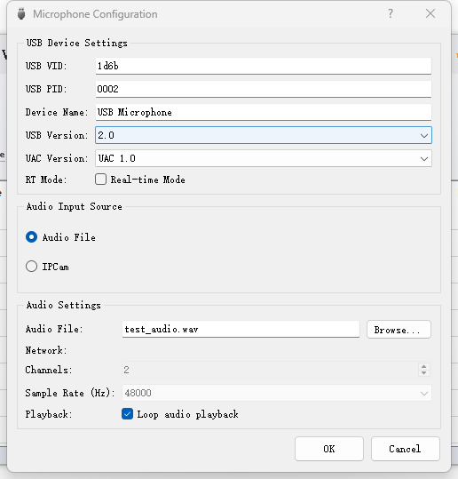

# ⚠️ The driver is not signed, please disable driver signature enforcement first, then install it.

[中文版本]

1,支持将一个视频文件或者音频文件虚拟成一个USB UAC麦克风.

2,支持将手机话筒虚拟成一个PC端的USB UAC麦克风.
    手机端需安装IP CAMERA软件,可自行在应用商店下载安装.
    
3,支持UAC1.0和UAC2.0两种协议.

[English Version]
1. Supports virtualizing a video file or audio file into a USB UAC microphone.
2. Supports virtualizing a mobile phone microphone into a USB UAC microphone on PC.
    The mobile phone needs to install IP CAMERA software, which can be downloaded from the app store.
3. Supports both UAC 1.0 and UAC 2.0 protocols.

[中文版本]
1,支持将一个视频文件或者音频文件虚拟成一个USB UAC麦克风.

2,支持将手机话筒虚拟成一个PC端的USB UAC麦克风.
    手机端需安装IP CAMERA软件,可自行在应用商店下载安装.
    
3,支持UAC1.0和UAC2.0两种协议.

[English Version]
1. Supports virtualizing a video file or audio file into a USB UAC microphone.
2. Supports virtualizing a mobile phone microphone into a USB UAC microphone on PC.
    The mobile phone needs to install IP CAMERA software, which can be downloaded from the app store.
3. Supports both UAC 1.0 and UAC 2.0 protocols.

